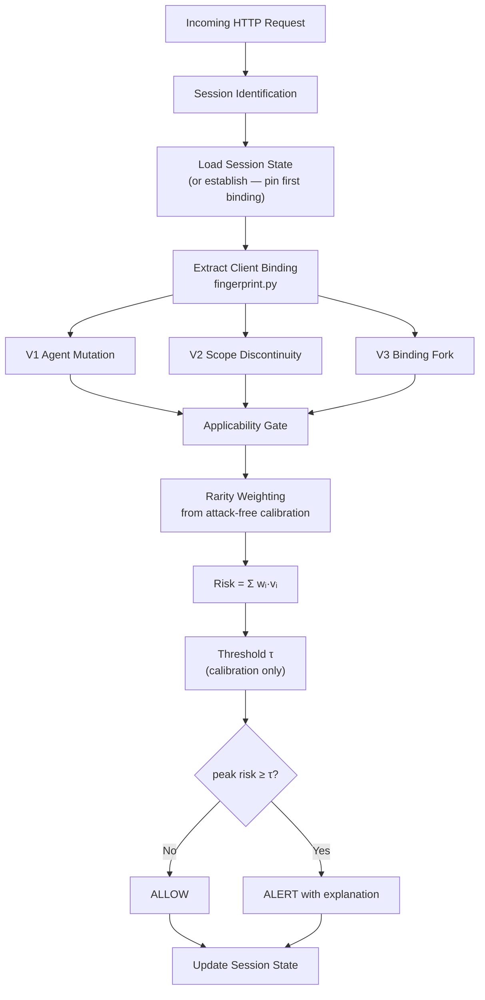

# SICA — Session Integrity and Continuity Analysis

**Detecting HTTP session hijacking from web server access logs — no machine learning.**

---

## The idea (start here)

When you log into a website, the server gives you a **session ID** (usually a
cookie). That ID is a **bearer credential**: whoever presents it gets served,
without typing the password again.

**Session hijacking** is when an attacker steals that ID and replays it. The
server still sees a valid session — no login check fails. The only clue is how
the session's **client fingerprint** changes over time: IP address, browser,
operating system, device type.

SICA watches those fingerprints request-by-request and asks one question:

> *Does this session's binding sequence show an interleaving that no single
> client can produce?*

### The binding fork

Each request gets a **binding** — a fingerprint from IP + User-Agent:

| Field | Example |
|---|---|
| IP address | `192.168.1.42` |
| Network /24 | `192.168.1` |
| Network /16 | `192.168` |
| Browser, OS, device | Chrome, Windows, Desktop |

- A **legitimate roaming user** abandons the old binding: `A A A B B B` (monotone).
- A **concurrent hijack** — victim and attacker both using the same session —
  necessarily **interleaves**: `A A B A B`, because the victim keeps browsing
  from binding A.

Monotone mobility cannot produce a revisit. A live concurrent hijack cannot
avoid one. That asymmetry is SICA's core insight.

### What SICA does (in one pass)

1. Parse the server's access log and group requests into sessions.
2. For every request, extract the client binding and evaluate **three rules**
   (invariants V1–V3): agent change, network-scope change, binding fork.
3. Combine rule scores into a **risk** using weights derived from **benign
   traffic only** — no attack labels, no ML.
4. Compare each session's **peak risk** to a threshold set to meet a declared
   false-alarm budget (α = 1%).
5. **Alert** when the threshold is crossed, naming which rules fired.

**SICA is not** login anomaly detection, account takeover, SQLi/XSS detection,
or generic ML anomaly detection. It targets **intra-session concurrent hijacking**
specifically.

→ Full technical walkthrough: [docs/PROJECT_GUIDE.md](docs/PROJECT_GUIDE.md)

---

## Navigation

| Want to… | Go to |
|---|---|
| Full architecture and workflow | [docs/PROJECT_GUIDE.md](docs/PROJECT_GUIDE.md) |
| Step-by-step reproduction | [REPRODUCIBILITY.md](REPRODUCIBILITY.md) |
| Every experiment (E0–E7) | [EXPERIMENTS.md](EXPERIMENTS.md) |
| Dataset provenance and limits | [DATASET.md](DATASET.md) |
| Current result status | [results/RUN_STATUS.md](results/RUN_STATUS.md) |
| Defect history | [AUDIT.md](AUDIT.md) |
| What is frozen | [CHECKPOINT.md](CHECKPOINT.md) |

---

## Architecture



### The three invariants

| Invariant | What it catches | Grading |
|---|---|---|
| **V1** Agent mutation | Browser/OS/device changed mid-session | 1.0 core change; 0.35 version-only |
| **V2** Scope discontinuity | Session used from a different network | 1.0 new /16; 0.45 new /24; 0.15 new host |
| **V3** Binding fork | Old binding reappears after a new one (interleaving) | 1.0 on revisit |

V4–V6 were implemented, evaluated, and not retained; E3 restores each so the
rejections are auditable. Details: [docs/PROJECT_GUIDE.md §Invariants](docs/PROJECT_GUIDE.md).

### Adversary levels (L0–L5)

| Level | Attacker address | Attacker agent | Detectable? |
|---|---|---|---|
| L0 | Own, different /16 | Own | Yes |
| L1 | Own, different /16 | Victim's (cloned) | Yes |
| L2 | Victim's /16, different /24 | Own | Yes |
| L3 | Victim's /24 | Victim's (cloned) | Yes |
| L4 | **Same as victim** (shared NAT) | Victim's (cloned) | **No** — identical binding |
| L5 | Same as victim (shared NAT) | Own | Yes (V1 fires) |

---

## Pipeline and experiments

`run_all.sh` orchestrates the full study. Individual stages can also be run
alone (see [How to run](#how-to-run) below).

| Stage | Script | Purpose | Typical time |
|---|---|---|---|
| tests | `pytest` | 50 unit + regression checks | ~10 s |
| E0 | `pipeline/exp01_corpus.py` | Corpus audit (sessions, agents) | ~2 min |
| E1 | `pipeline/exp02_main.py` | Main SICA results + budget sweep | ~5 min |
| E2 | `pipeline/exp02_main.py` | Baseline comparison | (same run as E1) |
| E3 | `pipeline/exp03_ablation.py` | Invariant ablation | ~3 min |
| E4 | `pipeline/exp04_robustness.py` | Adversary grid L0–L5 + sweeps | **~43 min** |
| E5 | `pipeline/exp05_leakage.py` | Leakage audit (26 checks) | ~2 min |
| E6 | `pipeline/exp06_efficiency.py` | Throughput and latency | ~1 min |
| E7 | `pipeline/exp07_stats.py` | Statistical tests | ~1 min |
| tables | `pipeline/make_tables.py` | LaTeX tables for paper | ~10 s |
| figures | `pipeline/exp08_figures.py` | 6 figures (PDF + PNG) | ~30 s |
| validate | `pipeline/validate.py` | 70 pipeline integrity checks | ~5 s |

**Configuration source of truth:** `pipeline/common.py` (seeds, α, workloads).
Component defaults: `sica/invariants.py`, `sica/monitor.py`, `sica/calibrate.py`,
`sica/inject.py`, `sica/churn.py`. `config.yaml` is a descriptive mirror only —
no code loads it.

### Detector code (`sica/`)

| File | Role |
|---|---|
| `fingerprint.py` | Request → client binding (IP, browser, OS, device) |
| `invariants.py` | V1/V2/V3 rules and grading constants |
| `monitor.py` | Stateful per-session monitor; ring buffer; ALLOW/ALERT |
| `calibrate.py` | Weights and threshold from benign calibration traffic |
| `sessionize.py` | Parse NCSA combined logs; group into sessions |
| `inject.py` | Simulate hijacks (L0–L5, takeover/concurrent) |
| `churn.py` | Inject benign IP mobility (DHCP/roaming simulation) |
| `baselines.py` | Non-ML baselines (IP pinning, scored rules) |
| `metrics.py` | Recall, precision, ROC AUC, F1, latency |
| `harness.py` | End-to-end: split → churn → inject → calibrate → evaluate |

### Where results land

| Output | Location |
|---|---|
| Result tables (39 CSVs) | `results/tables/` |
| Figures (6 × PDF + PNG) | `results/figures/` |
| Run logs | `results/logs/` |
| Metadata (environment, leakage) | `results/metadata/` |
| Generated paper tables | `paper/tables/` |

Key result files to open first:

- `results/tables/e1_main_summary.csv` — primary metrics (ROC AUC, recall, FPR, F1)
- `results/tables/e2_baselines.csv` — SICA vs pinning baselines
- `results/tables/e4_scenario_grid.csv` — per-adversary-level breakdown
- `results/tables/e6_efficiency.csv` — throughput and latency

→ Result provenance: [results/RUN_STATUS.md](results/RUN_STATUS.md)

---

## Datasets

Both corpora ship with the repository. **Do not modify** `data/raw/*.log`.

| ID | File | Traffic | Sessions | Requests |
|---|---|---|---|---|
| W1 | `data/raw/apache_sample_1.log` | Apache human web browsing (Elastic Examples) | 254 | 10,000 |
| W2 | `data/raw/nginx_real.log` | Elastic Nginx demo/sample corpus (APT-style clients) | 3,126 | 51,462 |

Source: public sample logs from the [Elastic Examples](https://github.com/elastic/examples)
repository (Apache-2.0), redistributed unmodified.

**Known limitations:**

- **W2 is demo data**, not production traffic — three placeholder URL paths, 65.8% 404s.
- **Timestamps are degenerate** (minute field always `05`/`06`) — no session exceeds
  59 s; no temporal-behaviour or detection-latency-in-seconds claims.
- **Attacks are injected** on top of real benign traffic — the substrate is real,
  the hijacking is simulated.

Verify integrity before running:

```bash
sha256sum data/raw/apache_sample_1.log data/raw/nginx_real.log
```

Expected hashes:

```
W1: f15c31e905f86c7b4b6ab44aee74d0a2086dce89f010187d983edea7ef0364ef
W2: 526832433ab552466dc8623390fd92dc052b4f301b2eec94836a5c42a46937df
```

→ Full dataset documentation: [DATASET.md](DATASET.md)

---

## Results (current, α = 0.01)

| Workload | ROC AUC [95% CI] | Recall | FPR | Precision | F₁ |
|---|---|---|---|---|---|
| W1 (human web) | **0.8836** [0.8665, 0.8995] | 0.3579 | 0.0085 | 0.9064 | 0.4968 |
| W2 (APT-style) | **0.8510** [0.8475, 0.8547] | 0.2291 | 0.0056 | 0.9201 | 0.3623 |

Throughput: **~55,000 req/s**, median latency **~16 µs** per request.
Tests: **50 passed**. Validation: **70 passed**. Leakage audit: **26 passed**.

These numbers are already present in `results/tables/` — you do **not** need to
re-run the pipeline just to view them.

---

## How to run

**Requirements:** Python **3.10+**, < 1 GB RAM, no network after install.

### 0. View existing results (no run needed)

Results are already generated and validated. Open the CSVs directly:

```bash
# Primary metrics
cat results/tables/e1_main_summary.csv

# SICA vs baselines
cat results/tables/e2_baselines.csv

# Figures
open results/figures/fig3_envelope.png   # macOS
```

See [results/RUN_STATUS.md](results/RUN_STATUS.md) for provenance of the current
result tree (complete and valid; no `PIPELINE_DONE` marker — explained there).

### 1. Install (first time only)

```bash
cd sica
python3 -m venv .venv
source .venv/bin/activate          # Windows: .venv\Scripts\activate
pip install -r requirements.txt
```

### 2. Verify the project works (~30 seconds)

Confirms the code and existing results are consistent — **does not re-run experiments**:

```bash
python3 -m pytest -q               # expect: 50 passed
python3 pipeline/validate.py       # expect: 70 passed, 0 failed
```

Both passed on a clean install as of 2026-09-21.

### 3. Partial runs (check or regenerate specific parts)

Run individual stages when you only need one experiment or want a faster check:

```bash
source .venv/bin/activate

python3 pipeline/exp01_corpus.py       # E0  dataset stats           ~2 min
python3 pipeline/exp02_main.py         # E1+E2  main + baselines    ~5 min
python3 pipeline/exp03_ablation.py     # E3  ablation              ~3 min
python3 pipeline/exp05_leakage.py      # E5  leakage audit         ~2 min
python3 pipeline/exp06_efficiency.py   # E6  efficiency            ~1 min
python3 pipeline/exp04_robustness.py   # E4  adversary grid        ~43 min
python3 pipeline/exp07_stats.py        # E7  statistical tests     ~1 min
python3 pipeline/make_tables.py        # LaTeX tables              ~10 s
python3 pipeline/exp08_figures.py      # figures                   ~30 s
python3 pipeline/validate.py           # integrity check           ~5 s
```

**Fastest meaningful partial check** (~7 min): E0 + E1/E2 + validate.

> **Before re-running over an existing `results/`:** archive it first. A failed
> partial re-run can mix old and new CSV generations. See
> [REPRODUCIBILITY.md §5](REPRODUCIBILITY.md).

### 4. Full pipeline

```bash
chmod +x run_all.sh    # first time only
./run_all.sh           # ~45–72 min on one core; writes results/PIPELINE_DONE
```

Stages run in order: tests → E0 → E1/E2 → E3 → E5 → E6 → E4 → E7 → tables →
figures → validate. A failure stops the run and writes `results/PIPELINE_ERR`.

**Smoke test** (~5–10 min, skips the ~43 min E4 grid — not for final reporting):

```bash
./run_all.sh --quick
```

**Include development studies** (seeds 100–119, not for reporting):

```bash
./run_all.sh --dev
```

### Run status at a glance

| Goal | Command | Time |
|---|---|---|
| See results now | Open `results/tables/e1_main_summary.csv` | 0 min |
| Confirm install + results valid | `pytest -q` + `pipeline/validate.py` | ~30 s |
| Regenerate main metrics only | `pipeline/exp02_main.py` | ~5 min |
| Full reproduction | `./run_all.sh` | ~45–72 min |
| Quick smoke test | `./run_all.sh --quick` | ~5–10 min |

→ Full details: [REPRODUCIBILITY.md](REPRODUCIBILITY.md)

---

## Repository structure

```text
SICA/
├── README.md                 ← you are here
├── REPRODUCIBILITY.md        ← full reproduction guide
├── EXPERIMENTS.md            ← per-experiment commands and outputs
├── DATASET.md                ← dataset documentation
├── run_all.sh                ← orchestrates tests → E0–E7 → tables → validate
├── requirements.txt
│
├── sica/                     ← detector (scientific core)
├── pipeline/                 ← experiment scripts E0–E7 + reporting
├── tests/                    ← 50 automated tests
├── data/raw/                 ← W1 and W2 access logs (frozen)
├── results/                  ← generated CSVs, figures, logs
│   └── RUN_STATUS.md         ← current result provenance
├── paper/                    ← draft manuscript + generated LaTeX tables
├── docs/                     ← frozen architecture and audit docs
└── results_archive/          ← ⚠ VOID — old run, do not cite
```

---

## Limitations

- **L4 is undetectable in principle** — co-located attacker with cloned User-Agent
  is identical to the victim's binding.
- **Attacks are constructed** — real traffic substrate, simulated hijacking.
- **W1 is small** (254 sessions); confidence intervals are wide.
- **Timestamps are degenerate** — no session exceeds 59 s; no timing claims.
- **Moderate recall** at α = 0.01 (~23–36%) with high precision (~91–92%).

Full limitations: [docs/PROJECT_GUIDE.md](docs/PROJECT_GUIDE.md) and [CHECKPOINT.md](CHECKPOINT.md).

---

## Licensing

| What | Licence |
|---|---|
| Code, documentation, generated results | MIT — [LICENSE](LICENSE) |
| `data/raw/*.log` (Elastic Examples) | Apache-2.0 — [LICENSE-APACHE-2.0.txt](LICENSE-APACHE-2.0.txt) |
| `paper/IEEEtran.cls` | LaTeX Project Public License |

Raw logs contain real client IP addresses, unmasked. See [DATASET.md](DATASET.md).

---

*Results complete and validated. See [results/RUN_STATUS.md](results/RUN_STATUS.md)
and [RESEARCH_RECORD.md](RESEARCH_RECORD.md) for current project state.*
