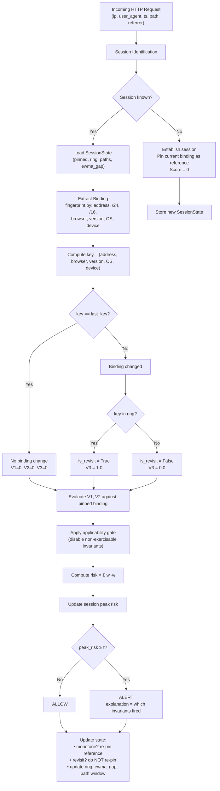

# SICA Project Guide — Full Technical Architecture and Workflow

This is the technical companion to [README.md](../README.md). A faculty member or
reviewer who wants to understand exactly how SICA works — without reading Python
source code — should read this document. For the research evolution story, see
[RESEARCH_HISTORY.md](RESEARCH_HISTORY.md). For result navigation, see
[../results/RESULTS_GUIDE.md](../results/RESULTS_GUIDE.md).

---

## Table of Contents

1. [Research Problem](#1-research-problem)
2. [Threat Model](#2-threat-model)
3. [Design Goals](#3-design-goals)
4. [Why the Original Approach Was Inadequate](#4-why-the-original-approach-was-inadequate)
5. [SICA Design Rationale](#5-sica-design-rationale)
6. [Session Binding — What SICA Observes](#6-session-binding--what-sica-observes)
7. [The Three Invariants](#7-the-three-invariants)
8. [Applicability Gate](#8-applicability-gate)
9. [Rarity / Surprisal Weighting](#9-rarity--surprisal-weighting)
10. [Risk Scoring](#10-risk-scoring)
11. [Threshold Calibration](#11-threshold-calibration)
12. [Complete Request-Level Workflow](#12-complete-request-level-workflow)
13. [Adversary Capability Ladder (L0–L5)](#13-adversary-capability-ladder-l0l5)
14. [Dataset Construction](#14-dataset-construction)
15. [Attack Injection](#15-attack-injection)
16. [Baselines](#16-baselines)
17. [Experiment Design](#17-experiment-design)
18. [Ablation Study (E3)](#18-ablation-study-e3)
19. [Robustness Study (E4)](#19-robustness-study-e4)
20. [Efficiency (E6)](#20-efficiency-e6)
21. [Limitations](#21-limitations)
22. [Reproducibility](#22-reproducibility)

---

## 1. Research Problem

A web server issues session identifiers to authenticate clients. Once issued, the
identifier is a **bearer credential**: the server serves whoever presents it,
without further identity verification. If an attacker obtains a valid, already-
authenticated session identifier (through XSS, network capture, log leakage,
malware, or any other means outside the defender's model) and replays it to the
same server, the server sees a perfectly valid session.

The attacker's requests carry no syntactic marker. No authentication check fails.
The only observable evidence of misuse is **how the session's observable client
context changes over time** from the moment of injection.

**SICA's scope is exactly this:**  
Detecting the intra-session binding inconsistency produced when two clients use
the same session identifier simultaneously.

### What SICA is not

| Detector type | Why it is out of scope |
|---|---|
| Login anomaly detection | Scores sessions against a user's historical profile — detects at login time, not mid-session |
| Account takeover detection | Same — a historical/profile-based signal |
| SQL injection / XSS detection | Payload inspection — a different threat |
| Brute-force detection | Authentication failure counting |
| Generic anomaly detection | No declared threat model |
| ML-based detection | SICA uses no learned components of any kind |

---

## 2. Threat Model

### Attacker

The attacker has obtained a valid, already-authenticated session identifier by
a means outside the model. They replay it from a client under their own control.

**The attacker can:**
- Choose any network position
- Forge any client-supplied header, including `User-Agent`
- Make requests to any endpoint the session authorises

**The attacker cannot:**
- Compromise the server or its logs
- Cause the victim's client to emit the attacker's requests
- Know the server's threshold or weights at calibration time

### Legitimate user

The user authenticates once and issues a stream of requests. They may:
- Change IP address (DHCP renewal, roaming, NAT rotation)
- Update their browser (producing a version change)
- Transiently alternate between two network interfaces during a handover

They cannot be in two network locations at once for an extended, interleaved period.

### Server

The server has access only to what it already logs:
- Remote IP address
- `User-Agent` header
- Timestamp, request path, HTTP status, response size
- `Referer` header
- Session identifier (cookie or token name) per request

**Not available:** TLS fingerprints, client-side telemetry, geolocation, token
binding, JavaScript execution context.

### Attack modes

| Mode | Description |
|---|---|
| **Takeover** | Victim falls silent after the theft point; only the attacker makes further requests |
| **Concurrent** | Victim and attacker both make requests in the same live session |

Concurrent mode is the harder case for SICA and the more informative evaluation
scenario, because the fork invariant requires an actual interleaving.

### Out of scope

- Session fixation (attacker sets the identifier, not steals it)
- Replay of a completed session
- Single-request attacks (SICA requires session state to accumulate)
- Cryptographic binding (Token Binding, DPoP) — SICA is for deployments without it

---

## 3. Design Goals

| Goal | Mechanism |
|---|---|
| **Non-ML** | Three invariants with fixed, declared constants. No fit, no training, no labels at decision time. Asserted by `pipeline/validate.py`. |
| **Lightweight** | O(1) time per request; O(1) state per live session. Bounded ring (4 entries), bounded path window (32 URLs). |
| **Explainable** | Every alert names the invariants fired and their violation degrees: e.g., `V2_scope_discontinuity=0.45\|V3_binding_fork=1.00`. |
| **Stateful** | Per-session state enables the fork invariant to detect interleaving across requests. |
| **Request-level** | Evaluated per incoming request, not on a completed session summary. |
| **Operator-controlled FPR** | Threshold derived from the (1−α) quantile of calibration peak risks; α is declared, not guessed. |
| **Deterministic** | Same request stream → identical output. No stochastic components at inference time. |
| **Reproducible** | All variance comes from the seed-controlled benchmark draw. Seeds are disjoint between development and reporting. |

---

## 4. Why the Original Approach Was Inadequate

The project's first version used a per-user profile-based anomaly detector — the
kind used for login anomaly detection or account takeover. It had six fundamental
defects that made all its numbers invalid. The most important conceptual defect:

> **A detector that scores a completed session against a user's historical
> profile is measuring the wrong thing for session hijacking.**

Session hijacking is an *intra-session* event. The attacker joins an
*already-authenticated, live* session. The correct unit of analysis is the
**request within a session**, evaluated statelessly from the server's log at
detection time. See [RESEARCH_HISTORY.md](RESEARCH_HISTORY.md) for the full
story, and [AUDIT.md](../AUDIT.md) for the defect record.

---

## 5. SICA Design Rationale

SICA was designed specifically for the intra-session detection problem.

### The binding fork insight

A legitimate user who roams produces a **monotone** sequence of bindings
(`A A A B B B`): the old binding is abandoned after the transition. A **concurrent
hijack** — attacker and victim using the same session identifier simultaneously —
necessarily produces a **revisit** (`A A B A B`): the victim keeps making requests
from their original binding.

Monotone mobility cannot produce a revisit. A concurrent hijack cannot avoid one.
That asymmetry is SICA's discriminative core.

### Why pinning rules are insufficient

A naive approach: alert whenever the IP address or User-Agent changes. Problems:

1. **False alarms**: legitimate users change IP addresses (DHCP, roaming, NAT
   rotation). Pinning to the exact IP fires on every such event.
2. **Evasion**: an attacker who can reproduce the victim's binding (e.g.,
   operating from behind the same NAT) bypasses pinning by construction.
3. **Budget ignorance**: a pinning rule has no mechanism for meeting a declared
   false-alarm rate — it fires at whatever rate the traffic produces.

SICA addresses all three:
- Severity is graded (host change ≠ /24 change ≠ /16 change).
- Weights are derived from actual benign firing rates on calibration traffic.
- The threshold is set to meet an operator-declared budget α.

---

## 6. Session Binding — What SICA Observes

`sica/fingerprint.py` maps each request's IP address and User-Agent string to a
structured `Binding` record.

| Field | Value | Example |
|---|---|---|
| `address` | Exact IP | `192.168.1.42` |
| `prefix24` | /24 prefix | `192.168.1` |
| `scope16` | /16 prefix (AS proxy) | `192.168` |
| `browser` | Browser family | `Chrome`, `Firefox`, `Bot` |
| `version` | Major version string | `121` |
| `os_family` | OS family | `Windows`, `macOS`, `Android` |
| `device` | Device class | `Desktop`, `Mobile`, `Tablet` |

**`core`** = `(browser, os_family, device)` — version-insensitive identity.  
**`key`** = `(address, browser, version, os_family, device)` — full hashable binding identity. The full address is included so that two hosts inside one /24 alternating within a session are correctly identified as an interleaving, not collapsed to the same key.

Unknown or absent User-Agents collapse to an explicit `unknown` identity, so a
disappearing agent is itself a detectable change.

---

## 7. The Three Invariants

All constants below are physical or protocol-level; none were selected against
evaluation labels. The invariant set was selected on the **development seed block
(100–119)**, disjoint from the reporting seeds, by threshold-free ROC AUC required
to agree across both workloads.

### V1 — Agent Mutation (`sica/invariants.py: v1_agent_mutation`)

**Security rationale.** A browser does not change its family, operating system,
or device class between two requests of the same live session. These are properties
of the physical device and installed software — they cannot change mid-session on
a single client.

**Grading:**
| Change type | Score |
|---|---|
| Browser family, OS, or device class changed | 1.0 |
| Only the major version changed | 0.35 |
| No change | 0.0 |

A major-version upgrade during a session is possible in principle (automatic
update) but does not preserve an in-memory session state in practice, so it is
scored as weak evidence rather than zero.

**Applicability gate:** Requires a recognisable User-Agent. Unknown agents do not
exercise this invariant.

### V2 — Scope Discontinuity (`sica/invariants.py: v2_scope_discontinuity`)

**Security rationale.** A session identifier is a bearer token. Presenting it
from a different administrative network than the one that obtained it is the
canonical observable of token replay. The grading separates routine address
changes from evidence of administrative-domain movement.

**Grading:**
| Change type | Score | Benign cause |
|---|---|---|
| /16 prefix changed | 1.0 | Left the administrative network |
| /24 changed, same /16 | 0.45 | Different access network, same AS |
| Exact address changed, same /24 | 0.15 | DHCP renewal, NAT pool rotation |
| No change | 0.0 | — |

**Why grading is essential.** A rule that treats all three cases alike inherits
the false-alarm rate of the most common one (host-level changes, which are
routine). Grading is what separates SICA from address pinning.

### V3 — Binding Fork (`sica/invariants.py: v3_binding_fork`)

**Security rationale.** This is the discriminative invariant. A user who
legitimately roams produces a monotone sequence: the old binding is abandoned.
A concurrent hijack produces a revisit: the victim keeps making requests from
their original binding, so when the attacker's binding appears and then the
victim's binding reappears, the revisit is detected.

**Grading:**
| Condition | Score |
|---|---|
| Binding revisit detected (new binding already in ring → interleaving) | 1.0 |
| Monotone transition or unchanged | 0.0 |

**The binding ring.** The monitor maintains a bounded ring (capacity 4) of the
most recently observed distinct bindings per session. A revisit occurs when the
current binding key is already in the ring but is different from the immediately
preceding key. This is an O(1) membership test.

**Reference migration.** A monotone transition (new binding not in the ring)
re-pins the reference binding, so the legitimate user is charged once for the
move, not for every subsequent request. A revisit never re-pins, because when two
bindings are interleaved there is no basis for determining which one is the session's
legitimate owner.

### The three rejected invariants

Three invariants were implemented, evaluated on the development seeds, and not
retained. All three remain in the codebase so that their rejection is auditable.

| Invariant | Primary rejection reason |
|---|---|
| **V4** transition velocity | No geolocation available — fires on the same scope-change event V2 already reports, double-counting one piece of evidence. Additionally, its 300 s settle time exceeds the longest session (59 s) on this corpus. |
| **V5** rate discontinuity | The source logs carry a degenerate minute field (always `05`/`06`), making all inter-arrival times generator artefacts, not real client behaviour. V5 measures generator noise on this corpus. |
| **V6** navigation break | Inapplicable to W2 (referrer coverage ≈ 0%); reduces ranking quality on W1. Retaining it also introduces a corpus-level parameter (first-party host set) into the deployed configuration. |

E3 (ablation) restores each of these one at a time and reports the effect.

---

## 8. Applicability Gate

**Purpose.** An invariant whose precondition can never hold on a given workload
should not be counted as "very rare on benign traffic" — it literally cannot fire.
Without the gate, such an invariant would receive the largest possible rarity weight
and dilute every invariant that is actually observable.

**Rule.** An invariant whose precondition holds on fewer than 1% of calibration
requests (`APPLICABILITY_FLOOR = 0.01` in `sica/calibrate.py`) is excluded from
the active set and its weight redistributed to the remaining invariants.

**Effect.** On W2, V6 has applicability ≈ 0.000 (no referrers) and is correctly
gated out. The active set on W2 is {V1, V2, V3}.

---

## 9. Rarity / Surprisal Weighting

**Formula:**
```
wᵢ ∝ log(1 / (εᵢ + ε₀))
```

where:
- εᵢ = mean violation degree of invariant i over attack-free calibration traffic
- ε₀ = 0.01 (floor preventing an invariant that never fires from dominating)
- Weights are normalised to sum to 1 over the active set

**Rationale.** An invariant that fires often on benign traffic carries little
information when it fires; one that almost never fires carries a great deal. The
weight is the self-information of the invariant firing under the benign model.

The logarithm is used in preference to 1/εᵢ because the reciprocal is unbounded
as εᵢ → 0 and lets a single quiet invariant dominate the score.

**This is not a fit.** No attack data and no evaluation observation contributes to
the weight derivation. The floor ε₀ is the only declared parameter beyond the
constants in `InvariantParams`.

---

## 10. Risk Scoring

```
risk(request) = Σᵢ wᵢ · vᵢ(request)
```

This is a deterministic weighted sum over the active invariants. It is not a
learned function, not a neural network output, and not a probabilistic score.

**Session-level evidence.** The monitor tracks the **peak per-request risk** over
all requests in the session. This is what is compared to the threshold at decision
time. The peak was selected over an alternative (decayed accumulator) on the
development seeds; the design switch comparison is in E3.

---

## 11. Threshold Calibration

### Label-free guarantee

Both weights and the threshold are derived **exclusively from attack-free
calibration traffic**. No attack label and no evaluation observation is read at
any point during calibration (`sica/calibrate.py: calibrate()`).

### Two-pass procedure

**Pass 1.** Replay the calibration sessions with unit weights to measure:
- εᵢ: mean benign violation degree per invariant (the firing rate)
- πᵢ: applicability of each invariant (precondition rate)

The applicability gate is applied. Weights are computed.

**Pass 2.** Replay the calibration sessions with the derived weights through the
*same* evidence pipeline that evaluation will use (including reference migration
and the peak-risk evidence mode). This yields the session peak risk distribution
over calibration sessions.

**Why two passes?** The threshold must be derived from the same statistic that
will be thresholded at evaluation time. Calibrating on a different statistic
(e.g., the raw per-request risk rather than the session peak risk) would silently
break the false-alarm budget guarantee.

### Threshold rule

τ is the **smallest observed calibration session peak risk** whose realised
in-sample alarm rate satisfies `≤ α`.

**Why not a quantile?** The risk statistic takes a small number of distinct values
(it is a weighted sum of a few invariants with fixed severities). A (1−α) quantile
lands on a plateau of tied values, and the `≥` test then admits the *entire*
plateau. The previous implementation used a quantile and overshot the budget by
2–4× on real traffic (measured: 2.15% and 1.85% at α = 0.01). The current rule
scans distinct observed values and returns the smallest qualifying threshold.

**Finite-sample behaviour.** Achievable alarm rates are multiples of 1/N for N
calibration sessions. If the budget is below 1/N, or if more than α·N sessions
are tied at the maximum risk, the conservative choice is taken: τ is placed just
above the maximum, alerting on nothing.

### Budget guarantee

The returned τ satisfies `P(peak risk ≥ τ | benign, calibration) ≤ α`. The
realised calibration alarm rate is always reported alongside τ. In the final
results, the worst calibration alarm rate across all 60 runs was **0.0096 ≤ 0.01**.

---

## 12. Complete Request-Level Workflow



### Complexity

- **Time:** O(1) per request — bounded ring membership test (4 entries), bounded
  path window (32 entries), three prefix comparisons, one user-agent parse.
- **Memory:** O(1) per live session. Analytic bound: 6×16 bytes (pinned binding)
  + 8×6 bytes (scalars) + 4×5×16 bytes (ring) + 32×48 bytes (paths) ≈ 1.8 KB
  per session. Measured flat over a 260× range of live-session counts in E6.

---

## 13. Adversary Capability Ladder (L0–L5)

The benchmark evaluates six masquerade levels. The full reported envelope is
L0–L5; restricting to L0–L3 would give address pinning perfect recall by
construction, reducing the benchmark to address-change detection.

| Level | Attacker address | Attacker agent | Classification |
|---|---|---|---|
| L0 | Own, different /16 | Own | Address-visible |
| L1 | Own, different /16 | Victim's (cloned) | Address-visible |
| L2 | Victim's /16, different /24 | Own | Address-visible |
| L3 | Victim's /24 | Victim's (cloned) | Address-visible |
| L4 | **Victim's own** (shared NAT) | Victim's (cloned) | Co-located; **information-theoretically undetectable** |
| L5 | **Victim's own** (shared NAT) | Own | Co-located; agent signal available |

**Why L4 is included but undetectable.** A co-located attacker who clones the
victim's agent presents an identical binding. A silent takeover at L4 is
information-theoretically identical to a monotone transition by the legitimate
user (both are one forward binding change). No binding-based server-side signal
can separate them. L4 is reported as the acknowledged blind spot, not excluded.

**L5 is detectable.** The attacker is co-located but uses a different client
program, so V1 (agent mutation) fires.

---

## 14. Dataset Construction

### Source logs

Two real web-server access logs in NCSA combined format, included in `data/raw/`.

| ID | File | Traffic | Raw requests | Sessions (≥7 req) |
|---|---|---|---|---|
| W1 | `apache_sample_1.log` | Apache human web browsing | 10,000 | 254 |
| W2 | `nginx_real.log` | Elastic Nginx demo/sample | 51,462 | 3,126 |

Both are public sample logs from the Elastic Examples repository (Apache-2.0).
W2 is demo data with three placeholder URL paths and 65.8% HTTP 404 responses.

**Known limitation: degenerate timestamps.** The minute field is always `05` in W1
and `05`/`06` in W2, so no session exceeds 59 seconds and all inter-arrival times
are generator artefacts. This means:
- No claim about realistic temporal behaviour
- No detection latency in seconds
- V4 cannot be assessed (300 s settle time > all sessions)
- V5 measures noise on this corpus
- The retained invariants (V1, V2, V3) read no timestamp and are unaffected

### Sessionisation

Group requests by (remote address, User-Agent); apply 1800 s idle timeout;
discard sessions under 7 requests. The grouping key is **ground truth only** —
the detector sees only a session identifier, not the address or agent directly.

### Split

Temporal 50/50: the first half of each workload by request time is the calibration
partition; the second half is the evaluation partition.

W1: **127 + 127** sessions. W2: **1,563 + 1,563** sessions.

### Benign mobility injection

A controlled rate of legitimate address changes is injected into both partitions
to simulate DHCP, roaming, and dual-homed clients:
- Monotone mobility rate: 0.15 (50% host, 30% /24, 20% /16)
- Flapping rate: 0.05

These are **assumptions about a deployment, not measurements**. Each is swept
across its plausible range in E4 and reported as a curve.

---

## 15. Attack Injection

**Source of attacker requests.** Attacker requests are taken verbatim from a
different real client of the same server, with only the binding substituted. The
attack class is therefore not a distinct synthetic distribution — it is real
requests wearing a different binding.

**Parameters:**
- Attack rate: 20% of evaluation sessions are targeted
- Attack fraction (concurrent mode): attacker makes 40% of post-theft requests
- Theft window: drawn from [25%, 50%] of session length; never moved after drawing
- Length-matched: injected sessions keep the original request count

**The final request is never displaced** in concurrent mode, ensuring a victim
request always follows the theft and the session genuinely interleaves.

**Injection is transparent at evaluation time.** The detector sees only the
session identifier and the request attributes; it does not know which requests
are injected.

---

## 16. Baselines

All baselines run on identical sessions from identical benchmark draws. Scored
baselines are calibrated to the **same α budget** by the **same threshold
procedure** on the **same calibration partition**.

**Pinning rules** (parameter-free, reported at their natural operating point):
`pin_ip`, `pin_prefix24`, `pin_scope16`, `pin_useragent`, `pin_useragent_core`,
`pin_ip_or_useragent`, `pin_ip_and_useragent`.

`pin_useragent_core` uses exactly the agent core that V1 uses, so the
comparison measures the rule, not the parser.

**Scored rules** (calibrated to α = 0.01):
`score_distinct_bindings`, `score_max_request_rate`, `score_burstiness`.

**Reporting distinction.** A pinning baseline is a binary rule with one operating
point and no ranking curve. Its ROC AUC collapses to balanced accuracy, which is
not a ranking metric. Ranking metrics (ROC AUC, PR AUC) are **withheld (`NaN`)
for all pinning rules** and only reported for detectors with a continuous score.

---

## 17. Experiment Design

**Budget:** α = 0.01 (session-level false-alarm rate).  
**Reporting seeds:** 0–29 (E1, E2); 0–19 (E3, E4, E5).  
**Development seeds:** 100–119 — disjoint from reporting seeds, used only for
design decisions, asserted by `pipeline/validate.py`.

| Experiment | Script | Purpose |
|---|---|---|
| E0 | `exp01_corpus.py` | Corpus audit: sessionisation parameters, agent mix |
| E1 | `exp02_main.py` | Main result at α=0.01, budget sweep |
| E2 | `exp02_main.py` | All baselines at matched budget |
| E3 | `exp03_ablation.py` | Ablation and restoration |
| E4 | `exp04_robustness.py` | Adversary grid (L0-L5 × 2 modes), assumption sweeps, crossover |
| E5 | `exp05_leakage.py` | Leakage audit: split sensitivity, marginal shortcuts |
| E6 | `exp06_efficiency.py` | Computational cost and scaling |
| E7 | `exp07_stats.py` | Statistical tests, base-rate table |

**Metrics.** All metrics are session-level (an operator responds to a session,
not an individual request). Accuracy is never reported (dominated by the negative
class at 20% prevalence). Detection latency is reported in attacker-request counts,
never in seconds (timestamps are degenerate).

---

## 18. Ablation Study (E3)

Each ablation variant is separately and fully calibrated. The comparison is
between two independently configured detectors, not a detector and a de-tuned copy.

| Family | Variants |
|---|---|
| `reference` | Full retained method (V1, V2, V3) |
| `leave_one_out` | Each of V1, V2, V3 removed in turn |
| `restored` | +V4, +V5, +V6 added back one at a time; all three together |
| `single` | Each invariant alone |
| `weighting` | Uniform weights instead of benign-rarity |
| `design` | Reference migration off; decayed accumulator instead of peak |

**Key finding.** V3 improves threshold-free ROC AUC (the pre-declared criterion)
on both workloads but can hurt F₁ at the α = 0.01 operating point. This cost is
documented in E3 rather than hidden. V3 is retained because the selection criterion
was threshold-free and pre-declared, not because it wins on every metric.

---

## 19. Robustness Study (E4)

### E4a — Adversary grid

All 24 cells of (L0–L5) × (takeover, concurrent) × (W1, W2), evaluated for SICA
and all baselines. This is the substantive result: it shows where each defence
works and where it fails, per adversary level.

### E4b — Assumption sweeps

Each swept factor is an assumption the benchmark makes, not a measurement:

| Factor | Values swept |
|---|---|
| Flapping rate | 0, 0.01, 0.02, 0.05, 0.10, 0.20 |
| Monotone mobility rate | 0, 0.05, 0.15, 0.30, 0.50 |
| Attack fraction | 0.05, 0.10, 0.20, 0.40, 0.60 |
| Prevalence | 0.02, 0.05, 0.10, 0.20, 0.35 |
| Theft position | [0.10-0.20], [0.25-0.50], [0.50-0.70], [0.70-0.85] |
| Theft delay | 0, 1, 60, 600 s — **inert on this corpus** |
| Minimum session length | 7, 10, 15, 20 requests |

**`theft_delay_s` is inert.** No session exceeds 59 s, so a 60 s or 600 s delay
is not expressible in the benchmark. It is retained so that its inertness is
itself a generated, checkable result — but it must not be presented as evidence of
robustness to attacker timing.

### E4c — Address-churn crossover

SICA and baselines as benign monotone mobility grows from 0 to 0.35. This locates
the mobility rate at which address pinning stops being preferable — the quantity an
operator needs to choose between defences.

---

## 20. Efficiency (E6)

SICA's request path is timed on an already-parsed stream (parsing and
sessionisation are timed separately and are not part of the deployed detector's
hot path).

| Metric | W1 | W2 |
|---|---|---|
| Throughput | 58,808 req/s | 52,007 req/s |
| Median latency | 15.9 µs | 17.1 µs |
| p99 latency | 48.2 µs | 52.1 µs |

The **reproducible claim** is the *flatness* of per-request cost as the live
session count grows — O(1) is confirmed over a 260× range. Absolute latency
numbers are hardware-dependent.

---

## 21. Limitations

1. **L4 is undetectable in principle.** A co-located attacker cloning the victim's
   agent presents an identical binding. A silent takeover at L4 is
   information-theoretically identical to a legitimate device change.

2. **W1 is small.** 254 sessions; confidence intervals are wide. Claims should not
   rest on W1 alone.

3. **Degenerate timestamps.** No session exceeds 59 s; no temporal claims, no
   detection latency in seconds.

4. **Session identity is reconstructed.** The logs carry no authentication state;
   sessions are grouped by (address, User-Agent), which is ground truth only for
   the benchmark, not observable by the detector.

5. **The attacks are constructed.** The traffic substrate is real; the hijacking is
   controlled injection. No real-world prevalence claim follows.

6. **Benign mobility shape is ours.** Rates are swept; the shape (50%/30%/20%
   granularity mix) is not measured. It assigns zero probability to a mid-session
   agent-core change, so the 0% false-alarm rate for `pin_useragent_core` is an
   upper bound on that baseline, not a measurement.

7. **FPR slightly exceeds budget.** At α = 0.01, measured ≈1.6–1.8%. The budget
   transfers from calibration to evaluation; it is not exactly met. This is due to
   the coarse-valued risk statistic.

8. **V3's contribution is small at the operating point.** Removing V3 raises F₁
   on both workloads at α = 0.01, though it reduces the threshold-free ROC AUC.

9. **Two residual marginal shortcuts.** `distinct_paths` on W2 (≈0.73 AUC) and
   `median_gap_s` on W1 (≈0.32). Neither can reach the detector.

10. **Development is a seed block, not a held-out corpus.** Development seeds draw
    different injections over the same benign sessions.

---

## 22. Reproducibility

### What is guaranteed

| Claim | Status |
|---|---|
| Methodology reproducibility (can be re-implemented) | **Strong** — every design decision is frozen and dated |
| Results reproducibility (re-run produces same findings) | **Strong for aggregates** — 30 seeds, means with bootstrap intervals |
| Bit-identical reproduction | **Conditional** — requires same NumPy version |

### Environment of record

CPython **3.11.15**, NumPy **2.4.4**, pandas **3.0.2** on
`Linux-6.18.44-fc-v24-x86_64`. Per-seed bit identity requires the same NumPy
version; aggregates are stable across versions.

### Timing claims

E6 absolute latency numbers are hardware-dependent. The reproducible claim is
flatness of per-request cost over a 260× range of live-session counts.

### Full instructions

See [../REPRODUCIBILITY.md](../REPRODUCIBILITY.md) for step-by-step commands.

---

*Source files: `sica/fingerprint.py`, `sica/invariants.py`, `sica/monitor.py`,
`sica/calibrate.py`, `sica/harness.py`. All implementation details above are
derived directly from the source code and frozen documentation.*
